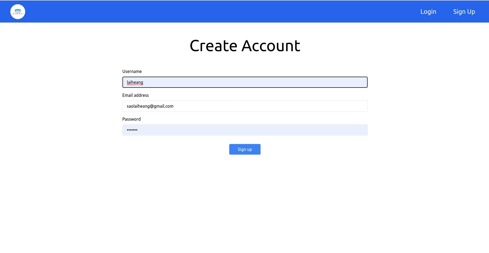

# React + Vite

This template provides a minimal setup to get React working in Vite with HMR and some ESLint rules.

Currently, two official plugins are available:

- [@vitejs/plugin-react](https://github.com/vitejs/vite-plugin-react/blob/main/packages/plugin-react/README.md) uses [Babel](https://babeljs.io/) for Fast Refresh
- [@vitejs/plugin-react-swc](https://github.com/vitejs/vite-plugin-react-swc) uses [SWC](https://swc.rs/) for Fast Refresh


//Project title 
# PSE x BiKay Link Shortener (PBLS)
// Describes the project
**- The URL Shortener Service is a web application that allows users to shorten long URLs into concise, manageable links. This service is beneficial for sharing links on social media, emails, and other platforms where brevity is essential. The project will include both front-end and backend components, ensuring a seamless user experience.**

## Technologies Used
**List all technologies, libraries, and tools used for front-end development are:**
- React :JavaScript library for building user interfaces.
- Tailwind(for styling)
- Vite: Development server and build tool.
- JSX: For building UI components.
- React Router Dom (for routing)
- Vite (for development server)
- Vercel (for deploy website)
- Github (for store Repositories)
- Jira (for manage Task)
- figma (for mockup design )
- Google drive(for documents)

### Project Structure
```src/
public/                # Static files (images, icons, etc.)
  └── vite.svg         # Vite logo
src/                   # Main source code folder
  ├── assets/          # Asset folder for images, fonts, etc.
  ├── components/      # Reusable UI components
  │   ├── Accountsdrop.jsx
  │   ├── Boxdata.jsx
  │   ├── Btn.jsx
  │   ├── Card.jsx
  │   ├── Expirationshorten.jsx
  │   ├── Expiretiondate.jsx
  │   ├── Header.jsx
  │   ├── Input.jsx
  │   ├── Responsiveqrcode.jsx
  │   ├── Sidebar.jsx
  │   └── Successalert.jsx
  ├── page/            # Pages (views)
  │   ├── AdminReportpage.jsx
  │   ├── Customaliasespage.jsx
  │   ├── DashboardPage.jsx
  │   ├── Landingpage.jsx
  │   ├── Loginpage.jsx
  │   ├── Profoilepage.jsx
  │   ├── ShortensUrl.jsx
  │   └── SignUp.jsx
  ├── until/           # Utility files
  │   └── app.js
  ├── App.jsx          # Main app component
  ├── App.css          # Global CSS for the app
  ├── index.css        # Root-level styling
  └── main.jsx         # Main entry point of the React app

```

### Installation & Setup
**1.Clone the repository:**
```bash
git clone git@github.com:PSE-BiKay-Link-Shortener/link-shortener-frontend.git
```
**2. Navigate to the project directory:**
```bash   
cd link-shortener-frontend
```
**3. Install dependencies:**
```bash   
npm install
```
**4. Start the development server:**
```bash   
npm run dev
```
### Development Workflow
Describe how the team can work on the project and the necessary commands for common tasks like testing, building, and running the app

**Start Development**:
  ```bash
  npm run dev
  ```
**Build for Production:**
```bash
npm run build
```
**Run Production Server:**
```bash
npm run test
```

### Usage
Once the project is set up and running, you can navigate to various pages like login, dashboard, and URL shortening. Key features include:
**- Shorten URLs** via ShortensUrl.jsx.
**-Manage aliases** on `Customaliasespage.jsx`.
**-Generate QR codes** for shortened URLs via `Responsiveqrcode.jsx`.
**-Authentication** with `Loginpage.jsx` and `SignUp.jsx`. 

### Component Overview
**Components**
    -` Accountsdrop.jsx:` Dropdown menu for user accounts, showing options like logout.
    -` Boxdata.jsx:` Box component to display data.
    -` Btn.jsx:` Reusable button component.
    -`Card.jsx:` Displays card-style components.
    - `Expirationshorten.jsx:` Manages display and expiration of shortened URLs.
    - `Header.jsx:` The main navigation bar of the app.
    - `Input.jsx:` A reusable input component for forms.
    - `Responsiveqrcode.jsx:` Generates responsive QR codes.
    - `Sidebar.jsx:` Collapsible sidebar for navigation.
    - `Successalert.jsx:` Displays success messages for user actions.

**-Pages**
-`AdminReportpage.jsx:` Displays reports for admin users.
-`Customaliasespage.jsx:` Allows users to manage custom aliases for shortened URLs.
-`DashboardPage.jsx:` The main dashboard showing user activity.
-`Landingpage.jsx:` The homepage of the application with login/signup options.
-`Loginpage.jsx:` The login page where users can sign in.
-`Profoilepage.jsx:` Displays the user profile and account details.
-`ShortensUrl.jsx:` The form and interface for shortening URLs.
-`SignUp.jsx:` The signup page for new user registration.

### Styling Guidelines
- Global styles are in `App.css`
- Component-specific styles are defined in the components.
- `Responsiveqrcode.jsx` includes responsive styling for QR code resizing.

### State Management
**- Context API or Redux is used to manage global state, especially for managing authenticated users and their shortened URLs.**
**- The state includes user authentication, URL data, and analytics information.**

### Best Practices
**- Use ESLint for code linting and Prettier for code formatting.**
**- Follow accessibility and SEO best practices for the front-end.**
**- Write clear, meaningful commit messages following the conventional commit standard (e.g., feat:, fix:, etc.).**

### Contributing
**- Fork the repository and create a feature branch.**
**- Submit a pull request once your feature is complete.**
**- Follow the style and commit guidelines before submitting.**
### Project Feature
*Landing Page*

*Signup page*

*LogIn page*

*Basic Shorten page*

*Profile Acc page*

*Custom aliases page*

*Admin report page*

*Dashboard page*


### Future Plan
